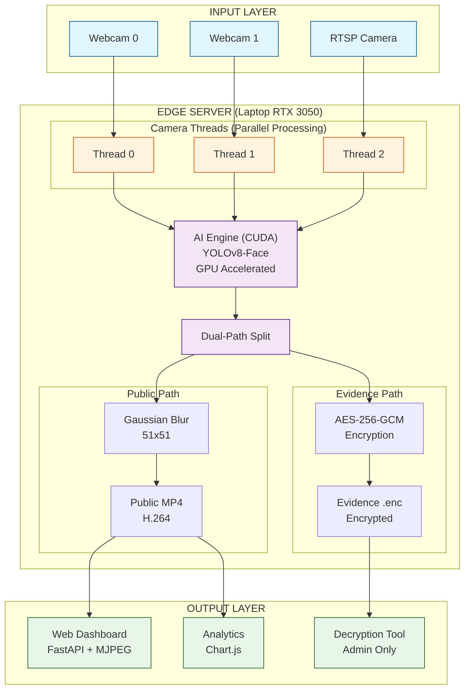

<div align="center">
  

  # 🛡️ SECURE EDGE
  ### Intelligent Surveillance System with Dual-Path Encryption
  
  
  
  
  

  **Advanced AI-powered surveillance system designed for real-time anonymization and forensic integrity.**
</div>

---

## 📖 Table of Contents
- [🛡️ SECURE EDGE](#️-secure-edge)
    - [Intelligent Surveillance System with Dual-Path Encryption](#intelligent-surveillance-system-with-dual-path-encryption)
  - [📖 Table of Contents](#-table-of-contents)
  - [🎯 Overview](#-overview)
  - [✨ Key Features](#-key-features)
    - [🤖 Intelligent AI Engine](#-intelligent-ai-engine)
    - [🔒 Dual-Path Security](#-dual-path-security)
    - [📊 Advanced Analytics](#-advanced-analytics)
  - [🏗️ System Architecture](#️-system-architecture)
  - [📚 Wiki Documentation](#-wiki-documentation)
  - [💻 Get Started](#-get-started)
    - [1. Requirements](#1-requirements)
    - [2. Quick Install](#2-quick-install)
    - [3. Run Application](#3-run-application)
  - [⚙️ Configuration](#️-configuration)
  - [🔐 Security Specifications](#-security-specifications)
  - [📊 Version History](#-version-history)
    - [🏷️ v1.3.0-stable (Current)](#️-v130-stable-current)
    - [🏷️ v1.2.x](#️-v12x)
  - [👨‍💻 Project Info](#-project-info)

---

## 🎯 Overview
**SECURE EDGE** adalah sistem surveilans cerdas berbasis **Edge Computing** yang menggabungkan deteksi objek AI real-time dengan enkripsi tingkat militer. Sistem ini dirancang khusus untuk skenario di mana privasi publik harus dijaga tanpa mengorbankan kebutuhan investigasi forensik.

> [!NOTE]
> Proyek ini dikembangkan sebagai bagian dari penelitian skripsi sarjana dengan fokus pada **Edge AI** dan **Sistem Keamanan Informasi**.

---

## ✨ Key Features

### 🤖 Intelligent AI Engine
- **Face Anonymization**: Secara otomatis memburamkan wajah pada *public stream* menggunakan YOLOv8 & Gaussian Blur.
- **Selective Recording**: Hanya menyimpan rekaman jika terdapat deteksi, menghemat penyimpanan hingga **80%**.
- **GPU Accelerated**: Dioptimalkan untuk NVIDIA CUDA untuk performa minimal 25-30 FPS.

### 🔒 Dual-Path Security
- **Public Path**: Video teranonymize (`.mp4`) untuk monitoring harian tanpa melanggar privasi.
- **Evidence Path**: Video asli terenkripsi (`.enc`) menggunakan **AES-256-GCM** untuk barang bukti hukum.
- **PIN Access**: Dekripsi langsung di browser melalui dashboard dengan autentikasi PIN.

### 📊 Advanced Analytics
- **Storage Predictor**: Estimasi kapan penyimpanan akan penuh berdasarkan kecepatan data.
- **Multi-Drive Monitor**: Memonitor kesehatan dan kapasitas seluruh disk drive dalam satu tampilan.
- **Visual Insights**: Grafik aktivitas puncak dan statistik deteksi harian menggunakan Chart.js.

---

## 🏗️ System Architecture



---

## 📚 Wiki Documentation

Dokumentasi teknis yang mendalam tersedia di Wiki Forgejo:
👉 **[SECURE EDGE VISION SYSTEM WIKI](http://192.168.0.135:3000/nakumi/SECURE-EDGE-VISION-SYSTEM/wiki)**

| Page | Description |
| :--- | :--- |
| **Architecture** | Detail teknis komponen dan alur thread. |
| **Security** | Spesifikasi kriptografi dan verifikasi integritas. |
| **Dual Path** | Penjelasan mekanisme privasi vs forensik. |
| **Quick Start** | Panduan instalasi dan deployment cepat. |
| **FAQ** | Kumpulan pertanyaan sidang skripsi. |

---

## 💻 Get Started

### 1. Requirements
- **Python**: 3.12+
- **OS**: Windows 10/11 (Recommended)
- **RAM**: 16GB (Min 8GB)
- **GPU**: NVIDIA RTX Series (for real-time detection)

### 2. Quick Install
```bash
# Clone the repository
git clone http://192.168.0.135:3000/nakumi/SECURE-EDGE-VISION-SYSTEM.git
cd SECURE-EDGE-VISION-SYSTEM

# Create environment
python -m venv .venv
.\.venv\Scripts\activate

# Install dependencies
pip install -r requirements.txt
```

### 3. Run Application
```bash
python main.py
```
Akses dashboard melalui: `http://localhost:8000`

---

## ⚙️ Configuration

Sistem dikonfigurasi melalui file `.env`. Berikut adalah parameter kritikal:

```env
# Camera Sources (Comma separated)
CAMERA_SOURCES=0,rtsp://192.168.1.100:554/stream

# AI Settings
DETECTION_CONFIDENCE=0.5
DEVICE=cuda

# Storage Paths
PUBLIC_RECORDINGS_PATH=recordings/public
EVIDENCE_RECORDINGS_PATH=recordings/evidence

# Security
ENCRYPTION_KEY_PATH=keys/master.key
```

---

## 🔐 Security Specifications
- **Algorithm**: AES-256-GCM (Authenticated Encryption).
- **Integrity**: SHA-256 binary hash checking pada setiap package.
- **Anti-Tampering Control**: Verifikasi digital signature sebelum dekripsi data bukti.
- **Key Management**: Kunci AES dienkripsi dengan Master PIN saat penyimpanan.

---

## 📊 Version History

### 🏷️ v1.3.0-stable (Current)
- ✅ Professional Documentation & Wiki Forgejo.
- ✅ Advanced Analytics & Multi-Drive Monitoring.
- ✅ Search & Filter Evidence by Filename/Date.
- ✅ Optimization: 5GB storage cleanup & performance tuning.

### 🏷️ v1.2.x
- ✅ Dashboard Decryption & PIN Authentication.
- ✅ In-Browser UI Evidence Gallery.

---

## 👨‍💻 Project Info
- **Project Name**: SECURE EDGE VISION SYSTEM
- **Researcher**: Bayu Cahyo
- **Category**: Undergraduate Thesis (Skripsi)
- **University**: Universitas Nasional (UNAS)

---
<div align="center">
  Developed with ❤️ for Academic Excellence
</div>
