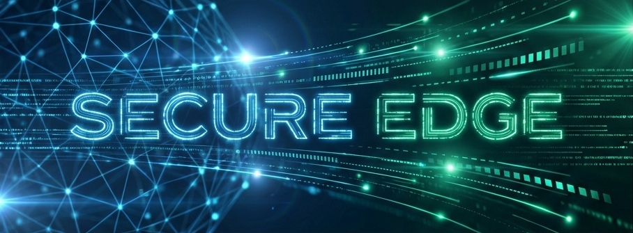
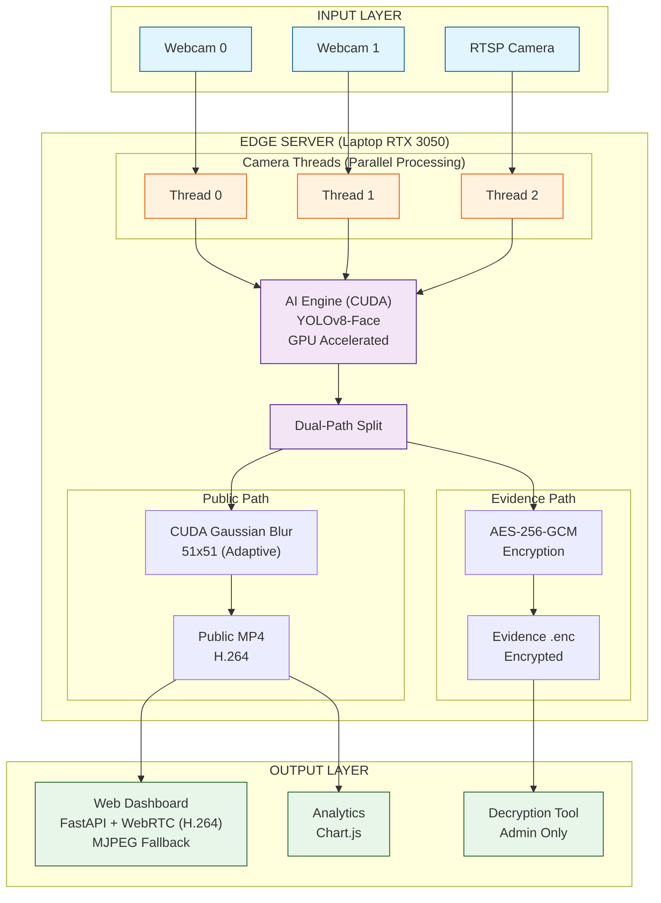

<div align="center">
  

# 🛡️ SECURE EDGE

### Intelligent Surveillance System with Dual-Path Encryption


**Advanced AI-powered surveillance system designed for real-time anonymization and forensic integrity.**

</div>

---

## 📖 Table of Contents

- [🛡️ SECURE EDGE](#️-secure-edge)
  - [Intelligent Surveillance System with Dual-Path Encryption](#intelligent-surveillance-system-with-dual-path-encryption)
  - [📖 Table of Contents](#-table-of-contents)
  - [🎯 Overview](#-overview)
  - [✨ Key Features](#-key-features)
    - [🤖 Intelligent AI Engine](#-intelligent-ai-engine)
    - [🔒 Dual-Path Security](#-dual-path-security)
    - [📊 Advanced Analytics](#-advanced-analytics)
  - [🏗️ System Architecture](#️-system-architecture)
  - [📚 Wiki Documentation](#-wiki-documentation)
  - [💻 Get Started](#-get-started)
    - [1. Requirements](#1-requirements)
    - [2. Quick Install](#2-quick-install)
    - [3. Run Application](#3-run-application)
  - [⚙️ Configuration](#️-configuration)
  - [🔐 Security Specifications](#-security-specifications)
  - [📊 Version History](#-version-history)
    - [🏷️ v1.3.0-stable (Current)](#️-v130-stable-current)
    - [🏷️ v1.2.x](#️-v12x)
  - [👨‍💻 Project Info](#-project-info)

---

## 🎯 Overview

**SECURE EDGE** adalah sistem surveilans cerdas berbasis **Edge Computing** yang menggabungkan deteksi objek AI real-time dengan enkripsi. Sistem ini dirancang khusus untuk skenario di mana privasi publik harus dijaga tanpa mengorbankan kebutuhan investigasi forensik.

> [!NOTE]
> Proyek ini dikembangkan sebagai bagian dari penelitian skripsi sarjana dengan fokus pada **Edge AI** dan **Sistem Keamanan Informasi**.

---

## ✨ Key Features

### 🤖 Intelligent AI Engine

- **Face Anonymization**: Blur wajah 51x51 berjalan **GPU-first (cv2.cuda)** dengan fallback CPU darurat dan adaptive kernel saat GPU pressure naik.
- **Selective Recording**: Hanya menyimpan rekaman jika terdapat deteksi, menghemat penyimpanan hingga **80%**.
- **GPU Accelerated**: Dioptimalkan untuk NVIDIA CUDA untuk performa minimal 25-30 FPS.

### 🔒 Dual-Path Security

- **Public Path**: Video teranonymize (`.mp4`) untuk monitoring harian tanpa melanggar privasi.
- **Evidence Path**: Video asli terenkripsi (`.enc`) menggunakan **AES-256-GCM** untuk barang bukti hukum.
- **PIN Access**: Dekripsi langsung di browser melalui dashboard dengan autentikasi PIN.

### 📊 Advanced Analytics

- **Storage Predictor**: Estimasi kapan penyimpanan akan penuh berdasarkan kecepatan data.
- **Multi-Drive Monitor**: Memonitor kesehatan dan kapasitas seluruh disk drive dalam satu tampilan.
- **Visual Insights**: Grafik aktivitas puncak dan statistik deteksi harian menggunakan Chart.js.

---

## 🏗️ System Architecture


```mermaid
graph TD
    classDef layer stroke:#333,stroke-width:2px,fill:#f9f9f9;
    classDef input fill:#e1f5fe,stroke:#01579b;
    classDef edge fill:#fff3e0,stroke:#e65100;
    classDef process fill:#f3e5f5,stroke:#4a148c;
    classDef output fill:#e8f5e9,stroke:#1b5e20;

    subgraph InputLayer ["INPUT LAYER"]
        Cam0["Webcam 0"]:::input
        Cam1["Webcam 1"]:::input
        CamR["RTSP Camera"]:::input
    end

    subgraph EdgeServer ["EDGE SERVER (Laptop RTX 3050)"]
        subgraph Threads ["Camera Threads (Parallel Processing)"]
            T0["Thread 0"]:::edge
            T1["Thread 1"]:::edge
            T2["Thread 2"]:::edge
        end

        AI["AI Engine (CUDA)<br/>YOLOv8-Face<br/>GPU Accelerated"]:::process
        Split["Dual-Path Split"]:::process

        subgraph PublicPath ["Public Path"]
            Blur["CUDA Gaussian Blur<br/>51x51 (Adaptive)"]
            MP4["Public MP4<br/>H.264"]
        end

        subgraph EvidencePath ["Evidence Path"]
            Encrypt["AES-256-GCM<br/>Encryption"]
            ENC["Evidence .enc<br/>Encrypted"]
        end
    end

    subgraph OutputLayer ["OUTPUT LAYER"]
        Dash["Web Dashboard<br/>FastAPI + WebRTC (H.264)<br/>MJPEG Fallback"]:::output
        Anal["Analytics<br/>Chart.js"]:::output
        Decr["Decryption Tool<br/>Admin Only"]:::output
    end

    Cam0 --> T0
    Cam1 --> T1
    CamR --> T2

    T0 & T1 & T2 --> AI
    AI --> Split

    Split --> Blur
    Blur --> MP4

    Split --> Encrypt
    Encrypt --> ENC

    MP4 --> Dash
    MP4 --> Anal
    ENC --> Decr
```

---

## 📚 Wiki Documentation

Dokumentasi teknis yang mendalam tersedia di folder `wiki/`:

📂 **[Lihat Wiki Documentation](wiki/Home.md)**

| Page                                     | Description                                       |
| :--------------------------------------- | :------------------------------------------------ |
| **[Home](wiki/Home.md)**                 | Overview dan daftar isi wiki                      |
| **[Architecture](wiki/Architecture.md)** | Detail teknis komponen dan alur thread            |
| **[Security](wiki/Security.md)**         | Spesifikasi kriptografi dan verifikasi integritas |
| **[Dual Path](wiki/DualPath.md)**        | Penjelasan mekanisme privasi vs forensik          |
| **[Installation](wiki/Installation.md)** | Panduan instalasi dan konfigurasi                 |
| **[Modules](wiki/Modules.md)**           | Dokumentasi modul-modul Python                    |
| **[API](wiki/API.md)**                   | Dokumentasi endpoint API                          |
| **[Performance](wiki/Performance.md)**   | Metrik performa dan benchmark                     |
| **[FAQ](wiki/FAQ.md)**                   | Kumpulan pertanyaan untuk sidang skripsi          |

---

## 💻 Get Started

### 1. Requirements

- **Python**: 3.11+
- **OS**: Windows 10/11 (Recommended)
- **RAM**: 16GB (Min 8GB)
- **GPU**: NVIDIA RTX Series (for real-time detection)

### 2. Quick Install

```bash
# Clone the repository
git clone http://192.168.0.135:3000/nakumi/SECURE-EDGE-VISION-SYSTEM.git
cd SECURE-EDGE-VISION-SYSTEM

# Create environment
python -m venv .venv
.\.venv\Scripts\activate

# Install dependencies
pip install -r requirements.txt
```

### 3. Run Application

```bash
python main.py
```

Akses dashboard melalui: `http://localhost:8000`

**Optional: Fix OpenH264 Codec (if you see warnings)**

```bash
# If you see "Failed to load OpenH264 library" warnings
python fix_openh264.py
```

> **Note**: The system works fine with the fallback `avc1` codec. This step is optional and only removes warning messages.

---

## 🎛️ Detection Presets

Sistem mendukung **2 preset deteksi** yang dapat dipilih tanpa mengubah kode:

### Preset 1 (Default)

- **Detector**: YOLOv8-Face (nano)
- **Tracker**: ByteTrack
- **Confidence**: 0.35
- **IoU**: 0.45

### Preset 2 (Alternative/Experimental)

- **Detector**: YOLOv11-Face (nano)
- **Tracker**: ByteTrack
- **Confidence**: 0.30
- **IoU**: 0.50

### Usage Examples

```bash
# Use default preset (Preset 1)
python main.py

# Use Preset 2 via CLI argument
python main.py --preset 2

# Use Preset 2 via environment variable
DETECTION_PRESET=2 python main.py

# Combine with other arguments
python main.py --preset 2 --device cuda --port 8080
```

Preset configuration is stored in `presets.yaml` and can be customized as needed.

---

## ⚙️ Configuration

Sistem dikonfigurasi melalui file `.env`. Berikut adalah parameter kritikal:

```env
# Camera Sources (Comma separated)
CAMERA_SOURCES=0,rtsp://192.168.1.100:554/stream

# AI Settings
DETECTION_CONFIDENCE=0.5
DEVICE=cuda

# Storage Paths
PUBLIC_RECORDINGS_PATH=recordings/public
EVIDENCE_RECORDINGS_PATH=recordings/evidence

# Security
ENVELOPE_ENCRYPTION_ENABLED=true
EDGE_KMS_KEK_B64=<base64-32-byte-kek>
```

---

## 🔐 Security Specifications

- **Algorithm**: AES-256-GCM (Authenticated Encryption).
- **Integrity**: SHA-256 binary hash checking pada setiap package.
- **Anti-Tampering Control**: Verifikasi digital signature sebelum dekripsi data bukti.
- **Key Management**: Envelope Encryption (DEK unik per evidence) + KEK ter-injeksi aman (KMS/TPM trust path), tanpa ketergantungan master key plaintext statis.

---

## 📊 Version History

### 🏷️ v1.4.0-stable (Current)

- ✅ Smart Video Overlays (Timestamp & Debug Info)
- ✅ Configurable overlay toggles via .env
- ✅ Stability fix for multi-camera stream processing

### 🏷️ v1.3.0

- ✅ Professional Documentation & Wiki Forgejo.
- ✅ Advanced Analytics & Multi-Drive Monitoring.
- ✅ Search & Filter Evidence by Filename/Date.
- ✅ Optimization: 5GB storage cleanup & performance tuning.

### 🏷️ v1.2.x

- ✅ Dashboard Decryption & PIN Authentication.
- ✅ In-Browser UI Evidence Gallery.

---

## 👨‍💻 Project Info

- **Project Name**: SECURE EDGE VISION SYSTEM
- **Researcher**: MUHAMMAD BAYU SEGARA
- **Category**: Undergraduate Thesis (Skripsi)
- **University**: Universitas Amikom Yogyakarta

---

<div align="center">
  Developed with ❤️ for Academic Excellence
</div>
