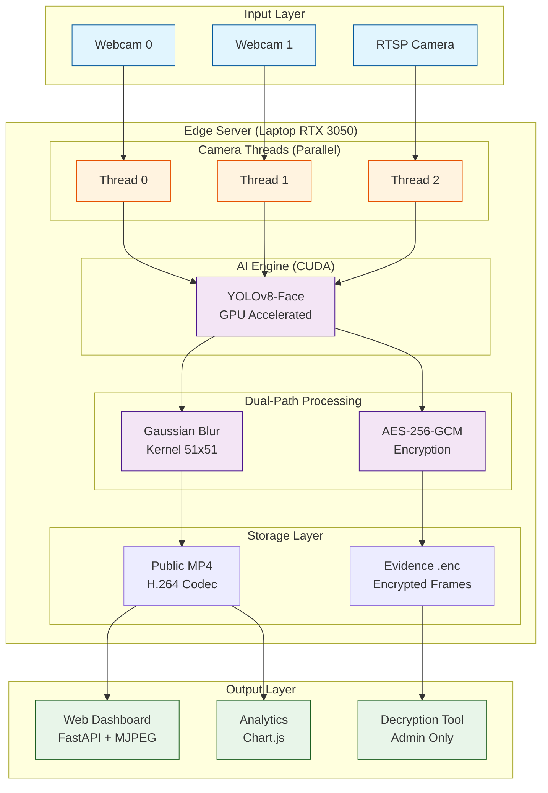
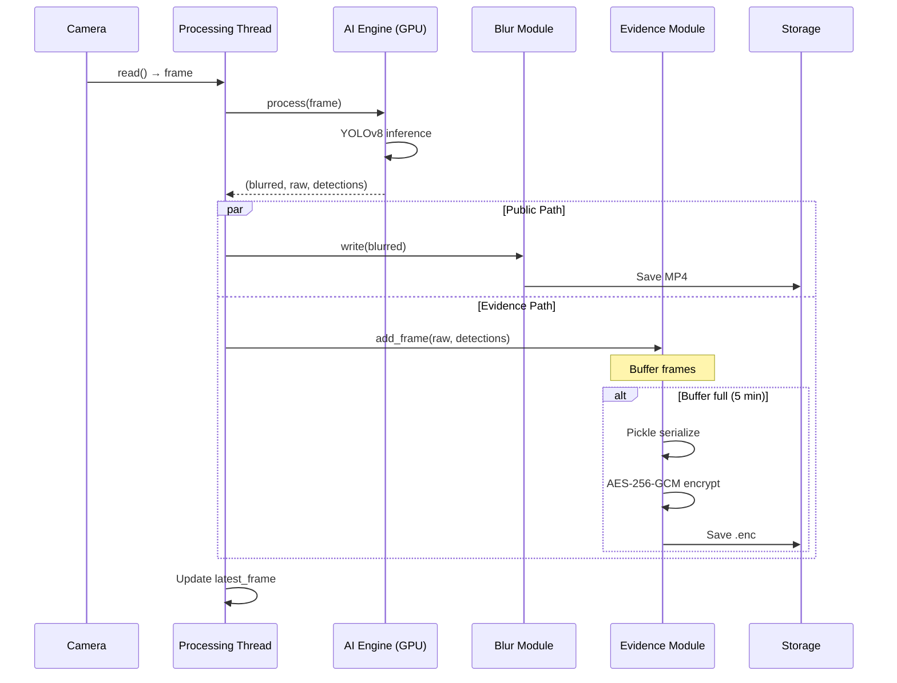

# 🏗️ Arsitektur Sistem

*Dokumentasi teknis arsitektur SECURE EDGE VISION SYSTEM*

---

## 📋 Daftar Isi

1. [Filosofi Desain](#-filosofi-desain)
2. [Diagram Arsitektur](#-diagram-arsitektur)
3. [Komponen Utama](#-komponen-utama)
4. [Alur Data (Data Flow)](#-alur-data-data-flow)
5. [Threading Model](#-threading-model)
6. [Inovasi Teknis](#-inovasi-teknis)

---

## 🎯 Filosofi Desain

### Edge Computing Paradigm

Sistem ini dirancang dengan paradigma **Edge Computing**, di mana:

- **Pemrosesan data dilakukan di lokasi (On-Premise)** menggunakan hardware lokal (laptop gaming dengan GPU)
- **Bukan cloud-based** - semua data sensitif tetap di jaringan lokal
- **High-Performance Edge Gateway** - bukan Raspberry Pi lemah, tapi GPU-accelerated server

**Trust Boundary:**
```
Data Masuk (Privasi Terancam) ──► Edge Server ──► Data Keluar (Anonim/Terenkripsi)
         │                           │                        │
     Raw Video                  YOLOv8 + AES             Public: Blur
                                                        Evidence: Encrypted
```

### Dual-Path Architecture

Sistem membagi aliran data menjadi **dua jalur independen**:

| Jalur | Tujuan | Proses | Output | Akses |
|:------|:-------|:-------|:-------|:------|
| **Public Path** | Monitoring harian | Frame → YOLOv8 → Blur | `.mp4` (anonim) | Staf umum |
| **Evidence Path** | Investigasi forensik | Frame → AES-256-GCM | `.enc` (terenkripsi) | Admin + PIN |

### Prinsip Desain

1. **Privacy by Design** - Privasi bukan fitur tambahan, tapi fondasi sistem
2. **Defense in Depth** - Multiple layer keamanan (blur + encryption + hash)
3. **Real-time Performance** - Target minimal 25 FPS untuk surveilans praktis
4. **Forensic Integrity** - Bukti harus tidak dapat dimodifikasi (tamper-proof)

---

## 📊 Diagram Arsitektur

### High-Level Architecture



### Layer Diagram (ASCII)

```
┌─────────────────────────────────────────────────────────────────────────┐
│                            INPUT LAYER                                   │
│                                                                          │
│    ┌──────────┐     ┌──────────┐     ┌─────────────────────────┐        │
│    │ Webcam 0 │     │ Webcam 1 │     │ RTSP IP Camera          │        │
│    │ (USB)    │     │ (USB)    │     │ rtsp://192.168.x.x:554  │        │
│    └────┬─────┘     └────┬─────┘     └───────────┬─────────────┘        │
│         │                │                       │                       │
└─────────┼────────────────┼───────────────────────┼──────────────────────┘
          │                │                       │
          ▼                ▼                       ▼
┌─────────────────────────────────────────────────────────────────────────┐
│                       EDGE SERVER LAYER                                  │
│                                                                          │
│  ┌────────────────────────────────────────────────────────────────────┐ │
│  │                    THREAD POOL (Per-Camera)                        │ │
│  │                                                                    │ │
│  │   ┌─────────────┐   ┌─────────────┐   ┌─────────────┐             │ │
│  │   │  Thread 0   │   │  Thread 1   │   │  Thread 2   │             │ │
│  │   │  - Capture  │   │  - Capture  │   │  - Capture  │             │ │
│  │   │  - Process  │   │  - Process  │   │  - Process  │             │ │
│  │   │  - Record   │   │  - Record   │   │  - Record   │             │ │
│  │   └──────┬──────┘   └──────┬──────┘   └──────┬──────┘             │ │
│  │          │                 │                 │                     │ │
│  └──────────┼─────────────────┼─────────────────┼─────────────────────┘ │
│             └─────────────────┼─────────────────┘                       │
│                               ▼                                          │
│  ┌────────────────────────────────────────────────────────────────────┐ │
│  │                    AI ENGINE (Shared)                              │ │
│  │                                                                    │ │
│  │   Model: YOLOv8-Face                Device: CUDA (RTX 3050)       │ │
│  │   Input: 640x640 RGB                Confidence: 0.5               │ │
│  │   Output: Bounding Boxes            Speed: ~15ms/frame            │ │
│  │                                                                    │ │
│  └────────────────────────────┬───────────────────────────────────────┘ │
│                               │                                          │
│               ┌───────────────┴───────────────┐                         │
│               ▼                               ▼                          │
│  ┌─────────────────────────┐   ┌─────────────────────────────────────┐  │
│  │      PUBLIC PATH        │   │         EVIDENCE PATH               │  │
│  │                         │   │                                     │  │
│  │  ┌─────────────────┐    │   │  ┌─────────────────────────────┐   │  │
│  │  │  Gaussian Blur  │    │   │  │     AES-256-GCM Encrypt     │   │  │
│  │  │  Kernel: 51x51  │    │   │  │  + SHA-256 Integrity Hash   │   │  │
│  │  │  Padding: +15%  │    │   │  │  + Metadata Embedding       │   │  │
│  │  └────────┬────────┘    │   │  └──────────────┬──────────────┘   │  │
│  │           │             │   │                 │                   │  │
│  │  ┌────────▼────────┐    │   │  ┌──────────────▼──────────────┐   │  │
│  │  │  VideoWriter    │    │   │  │     Encrypted File Writer   │   │  │
│  │  │  H.264 Codec    │    │   │  │     Binary .enc Format      │   │  │
│  │  │  720p @ 30fps   │    │   │  │     JPEG Quality: 75%       │   │  │
│  │  └────────┬────────┘    │   │  └──────────────┬──────────────┘   │  │
│  │           │             │   │                 │                   │  │
│  │           ▼             │   │                 ▼                   │  │
│  │   recordings/public/    │   │     recordings/evidence/            │  │
│  │   *.mp4                 │   │     *.enc                           │  │
│  └─────────────────────────┘   └─────────────────────────────────────┘  │
│                                                                          │
└──────────────────────────────────────────────────────────────────────────┘
                              │                      │
                              ▼                      ▼
┌─────────────────────────────────────────────────────────────────────────┐
│                          OUTPUT LAYER                                    │
│                                                                          │
│   ┌────────────────┐  ┌─────────────────┐  ┌─────────────────────────┐  │
│   │ Web Dashboard  │  │  Video Gallery  │  │   Decryption Tool       │  │
│   │ (Live Stream)  │  │  (Replay MP4)   │  │   (Admin PIN Required)  │  │
│   │                │  │                 │  │                         │  │
│   │ - MJPEG Stream │  │ - Browse Files  │  │ - Select .enc file      │  │
│   │ - Multi-Camera │  │ - Date Filter   │  │ - Enter PIN/Key         │  │
│   │ - FPS Counter  │  │ - Video Player  │  │ - Verify Integrity      │  │
│   └────────────────┘  └─────────────────┘  └─────────────────────────┘  │
│                                                                          │
└─────────────────────────────────────────────────────────────────────────┘
```

---

## 🧩 Komponen Utama

### 1. Input Layer

#### Camera Sources
| Tipe | Protokol | Contoh | Latency |
|:-----|:---------|:-------|:--------|
| **USB Webcam** | DirectShow (Windows) / V4L2 (Linux) | `0`, `1`, `2` | ~10ms |
| **IP Camera** | RTSP over TCP | `rtsp://192.168.1.100:554/stream` | ~100-300ms |
| **Virtual Camera** | - | OBS Virtual Camera | ~50ms |

#### OpenCV VideoCapture Settings
```python
cap = cv2.VideoCapture(source)
cap.set(cv2.CAP_PROP_FRAME_WIDTH, 1280)
cap.set(cv2.CAP_PROP_FRAME_HEIGHT, 720)
cap.set(cv2.CAP_PROP_FPS, 30)
cap.set(cv2.CAP_PROP_BUFFERSIZE, 1)  # Minimize latency
```

### 2. Processing Layer

#### FrameProcessor (`modules/processor.py`)
- **Model**: YOLOv8-Face atau YOLOv11-Face (configurable via presets)
- **Tracker**: BoT-SORT atau ByteTrack (configurable via presets)
- **Inference Size**: 640x640 pixels
- **Device**: CUDA (fallback ke CPU jika tidak tersedia)
- **Confidence Threshold**: 0.35 (Preset 1) atau 0.30 (Preset 2)
- **IoU Threshold**: 0.45 (Preset 1) atau 0.50 (Preset 2)

#### Detection Presets
| Preset | Detector | Tracker | Confidence | IoU |
|:-------|:---------|:--------|:-----------|:----|
| **1** (Default) | YOLOv8-Face | BoT-SORT | 0.35 | 0.45 |
| **2** (Alternative) | YOLOv11-Face | ByteTrack | 0.30 | 0.50 |

#### Detection Pipeline
```
Raw Frame (1280x720)
       │
       ▼
┌─────────────────────┐
│  YOLOv8 Inference   │
│  (GPU: ~15ms)       │
└──────────┬──────────┘
           │
           ▼
┌─────────────────────┐
│  Face Bounding Box  │
│  [x1, y1, x2, y2]   │
│  + Confidence Score │
└──────────┬──────────┘
           │
           ▼
┌─────────────────────┐
│  Padding +15%       │
│  (Better coverage)  │
└──────────┬──────────┘
           │
    ┌──────┴──────┐
    ▼             ▼
┌─────────┐  ┌─────────┐
│ BLUR    │  │ ENCRYPT │
│ (Public)│  │ (Evid.) │
└─────────┘  └─────────┘
```

### 3. Storage Layer

#### Public Recording (`modules/recorder.py`)
- **Format**: MP4 (H.264 codec)
- **Resolution**: 720p (1280x720)
- **FPS**: 30 fps
- **Rotation**: Setiap 5 menit atau saat deteksi berhenti

#### Evidence Recording (`modules/evidence.py`)
- **Format**: Custom binary (`.enc`)
- **Compression**: JPEG (quality 75%)
- **Encryption**: AES-256-GCM
- **Integrity**: SHA-256 hash embedded

### 4. Output Layer

#### FastAPI Server (`main.py`)
- **Framework**: FastAPI + Uvicorn
- **Streaming**: MJPEG over HTTP
- **Templates**: Jinja2
- **Static Files**: CSS, JavaScript

---

## 🔄 Alur Data (Data Flow)

### Frame Processing Flow

```
Step 1: CAPTURE
┌─────────────────┐
│  Camera.read()  │  ◄── OpenCV VideoCapture
│  Returns: frame │
└────────┬────────┘
         │
         ▼
Step 2: RESIZE (If needed)
┌─────────────────┐
│  Smart Resize   │  ◄── Center-crop to 16:9, then resize to 720p
│  1280x720       │
└────────┬────────┘
         │
         ▼
Step 3: DETECT
┌─────────────────┐
│  YOLOv8-Face    │  ◄── GPU inference (~15ms)
│  Returns: boxes │
└────────┬────────┘
         │
         ├──────────────────────┐
         │                      │
         ▼                      ▼
Step 4A: BLUR             Step 4B: ENCRYPT
┌─────────────────┐       ┌─────────────────────┐
│  Gaussian Blur  │       │  JPEG Encode        │
│  on face region │       │  AES-256-GCM Lock   │
└────────┬────────┘       │  Add to buffer      │
         │                └──────────┬──────────┘
         │                           │
         ▼                           ▼
Step 5A: RECORD           Step 5B: FLUSH (When full)
┌─────────────────┐       ┌─────────────────────┐
│  VideoWriter    │       │  Serialize (Pickle) │
│  Write to MP4   │       │  Save to .enc file  │
└────────┬────────┘       └──────────┬──────────┘
         │                           │
         ▼                           ▼
Step 6: STREAM
┌─────────────────┐
│  Update latest  │
│  frame for web  │
└─────────────────┘
```

### Encryption Flow (Detail)

Lihat [Security.md](Security.md) untuk detail lengkap.

---

## 🧵 Threading Model

### Multi-Camera Threading

```
Main Thread (FastAPI/Uvicorn)
│
├── Thread 0 (Camera 0)
│   └── processing_loop(0)
│       ├── cv2.VideoCapture.read()
│       ├── processor.process()
│       ├── recorder.write()
│       └── evidence.add_frame()
│
├── Thread 1 (Camera 1)
│   └── processing_loop(1)
│       └── ... (same as above)
│
└── Thread 2 (Camera 2)
    └── processing_loop(2)
        └── ... (same as above)
```

### Thread Safety Mechanisms

| Resource | Protection | Reason |
|:---------|:-----------|:-------|
| `latest_frames[idx]` | `threading.Lock` | Web streaming reads concurrently |
| AI Model | Shared (no lock) | PyTorch handles internal synchronization |
| VideoWriter | Per-camera instance | No shared state |
| Evidence Buffer | Per-camera instance | No shared state |

### Code Example
```python
# modules/engine.py

class EdgeVisionSystem:
    def __init__(self):
        self.frame_locks = {}  # {camera_idx: Lock}
        self.latest_frames = {}  # {camera_idx: frame}
        
    def process_frame(self, camera_idx: int) -> bool:
        # ... detection and processing ...
        
        # Thread-safe frame update
        with self.frame_locks[camera_idx]:
            self.latest_frames[camera_idx] = blurred.copy()
            
        return True
```

---

## 💡 Inovasi Teknis

### 1. Selective Evidence Recording

**Problem**: Menyimpan semua frame = storage penuh dalam hitungan jam

**Solution**: 
- Hanya rekam frame yang mengandung deteksi wajah
- Pre-roll buffer 30 frames (~1 detik) untuk konteks sebelum deteksi
- Estimasi penghematan: **80% storage reduction**

```python
# modules/evidence.py

if self.detection_only:
    if not detections:
        # No detection - add to pre-roll only
        self.pre_roll.append(frame_data)
        if len(self.pre_roll) > self.pre_roll_size:
            self.pre_roll.pop(0)
        return
    else:
        # Detection found - include pre-roll
        if not self.buffer:
            self.buffer.extend(self.pre_roll)
            self.pre_roll = []
```

### 2. Non-Blocking Evidence Flush

**Problem**: Enkripsi + disk I/O blocking thread kamera (lag 2-5 detik)

**Solution**: Background flush dengan threading

```python
def flush(self, blocking: bool = True) -> Optional[str]:
    if not blocking:
        # Run encryption in background
        thread = threading.Thread(target=encrypt_and_save, daemon=True)
        thread.start()
        return None
```

### 3. Auto-Reconnect for RTSP Cameras

**Problem**: IP cameras disconnect frequently (network issues, camera restart)

**Solution**: Automatic reconnection loop dengan exponential backoff

```python
# modules/engine.py

while system.running:
    if system.caps[camera_idx] is None:
        system.camera_status[camera_idx] = "connecting"
        cap = cv2.VideoCapture(src, cv2.CAP_FFMPEG)
        
        if cap.isOpened():
            system.caps[camera_idx] = cap
            system.camera_status[camera_idx] = "online"
        else:
            time.sleep(5)  # Retry in 5 seconds
            continue
```

### 4. Smart Aspect Ratio Handling

**Problem**: Different cameras have different aspect ratios (16:9, 4:3, etc.)

**Solution**: Center-crop to 16:9 before resize

```python
target_aspect = 16 / 9
current_aspect = w / h

if current_aspect > target_aspect:
    # Source is wider - crop horizontally
    new_w = int(h * target_aspect)
    x_offset = (w - new_w) // 2
    frame = frame[:, x_offset:x_offset + new_w]
else:
    # Source is taller - crop vertically
    new_h = int(w / target_aspect)
    y_offset = (h - new_h) // 2
    frame = frame[y_offset:y_offset + new_h, :]
```

---

## 📐 Diagram Alur Lengkap

### Sequence Diagram: Frame Processing



---

## 📖 Referensi Kode

| Komponen | File | Fungsi Utama |
|:---------|:-----|:-------------|
| System Orchestrator | `modules/engine.py` | `EdgeVisionSystem`, `processing_loop()` |
| AI Detection | `modules/processor.py` | `FrameProcessor.process()` |
| Public Recording | `modules/recorder.py` | `VideoRecorder.write()` |
| Evidence Recording | `modules/evidence.py` | `EvidenceManager.add_frame()` |
| Encryption | `modules/security.py` | `SecureVault.lock_evidence()` |
| Web Server | `main.py` | FastAPI routes |
| Configuration | `config.py` | `Config` class, preset loading |
| Presets | `presets.yaml` | Detection configuration presets |

---

## ➡️ Navigasi Wiki

| Sebelumnya | Selanjutnya |
|:-----------|:------------|
| [QuickStart](QuickStart.md) | [Security](Security.md) |
