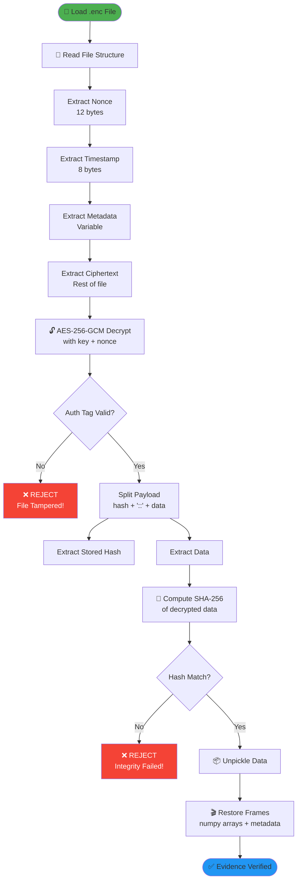

# 🔐 Security & Encryption

*Dokumentasi teknis keamanan dan enkripsi SECURE EDGE VISION SYSTEM*

---

## 📋 Daftar Isi

1. [Overview Keamanan](#-overview-keamanan)
2. [Algoritma Enkripsi](#-algoritma-enkripsi)
3. [AES-256-GCM Detail](#-aes-256-gcm-detail)
4. [SHA-256 Integrity](#-sha-256-integrity)
5. [RSA Hybrid Encryption](#-rsa-hybrid-encryption)
6. [Key Management](#-key-management)
7. [File Format](#-file-format)
8. [Proses Dekripsi](#-proses-dekripsi)
9. [Attack Scenarios](#-attack-scenarios)
10. [Mathematical Proof](#-mathematical-proof)

---

## 🛡️ Overview Keamanan

### Tujuan Keamanan

Sistem ini dirancang untuk memenuhi **tiga pilar keamanan informasi**:

| Pilar | Implementasi | Deskripsi |
|:------|:-------------|:----------|
| **Confidentiality** | AES-256-GCM Encryption | Data hanya bisa dibaca oleh pemilik kunci |
| **Integrity** | SHA-256 + GCM Auth Tag | Mendeteksi modifikasi sekecil apapun |
| **Authenticity** | GCM Authentication Tag | Membuktikan data berasal dari sumber yang sah |

### Security Layers

```
┌─────────────────────────────────────────────────────────────────┐
│                    DEFENSE IN DEPTH                              │
├─────────────────────────────────────────────────────────────────┤
│                                                                  │
│  Layer 1: PRIVACY (Real-time)                                    │
│  ┌─────────────────────────────────────────────────────────┐    │
│  │  Gaussian Blur (51x51 kernel)                           │    │
│  │  - Irreversible transformation                          │    │
│  │  - Destroys facial features permanently                 │    │
│  └─────────────────────────────────────────────────────────┘    │
│                                                                  │
│  Layer 2: CONFIDENTIALITY (At-Rest)                              │
│  ┌─────────────────────────────────────────────────────────┐    │
│  │  AES-256-GCM Encryption                                 │    │
│  │  - Military-grade encryption                            │    │
│  │  - 256-bit key (2^256 combinations)                     │    │
│  └─────────────────────────────────────────────────────────┘    │
│                                                                  │
│  Layer 3: INTEGRITY (Verification)                               │
│  ┌─────────────────────────────────────────────────────────┐    │
│  │  SHA-256 Hash + GCM Authentication Tag                  │    │
│  │  - Double verification layer                            │    │
│  │  - Detects any tampering                                │    │
│  └─────────────────────────────────────────────────────────┘    │
│                                                                  │
└─────────────────────────────────────────────────────────────────┘
```

---

## 🔑 Algoritma Enkripsi

### Spesifikasi Teknis

| Parameter | Nilai | Standar |
|:----------|:------|:--------|
| **Encryption Algorithm** | AES-256-GCM | NIST SP 800-38D |
| **Key Size** | 256 bits (32 bytes) | NIST Recommended |
| **Nonce Size** | 96 bits (12 bytes) | GCM Standard |
| **Tag Size** | 128 bits (16 bytes) | GCM Standard |
| **Hash Algorithm** | SHA-256 | FIPS PUB 180-4 |
| **Hash Output** | 256 bits (64 hex chars) | - |

### Mengapa AES-256-GCM?

**AES (Advanced Encryption Standard):**
- Standar enkripsi resmi pemerintah AS (NIST)
- Digunakan untuk data "TOP SECRET" level
- Terbukti aman selama >20 tahun

**GCM (Galois/Counter Mode):**
- **Authenticated Encryption** = Encryption + Integrity dalam satu operasi
- Lebih cepat dari CBC + HMAC (parallelizable)
- Tidak rentan terhadap padding oracle attacks

**256-bit Key:**
- Keamanan maksimal: 2^256 kemungkinan kunci
- Quantum-resistant hingga quantum computers 256-qubit

---

## 🔒 AES-256-GCM Detail

### Cara Kerja AES-GCM

```
                     ┌─────────────────────────────────────┐
                     │         AES-256-GCM ENGINE          │
                     ├─────────────────────────────────────┤
                     │                                     │
Input:               │                                     │
  • Key (32 bytes)   │   ┌─────────────────────────┐      │
  • Nonce (12 bytes) │   │    AES-256 CTR Mode     │      │
  • Plaintext        │   │    (Counter Encryption) │      │
                     │   └────────────┬────────────┘      │
                     │                │                    │
                     │   ┌────────────▼────────────┐      │
                     │   │      GHASH Function     │      │
                     │   │   (Galois Authentication)│      │
                     │   └────────────┬────────────┘      │
                     │                │                    │
Output:              │                │                    │
  • Ciphertext       │   ┌────────────▼────────────┐      │
  • Auth Tag (16B)   │   │   Ciphertext + Auth Tag │      │
                     │   └─────────────────────────┘      │
                     │                                     │
                     └─────────────────────────────────────┘
```

### Proses Enkripsi Step-by-Step

```python
# modules/security.py

def lock_evidence(self, raw_bytes: bytes, metadata: dict) -> EncryptedPackage:
    """
    Enkripsi evidence dengan integrity protection
    """
    
    # Step 1: Compute SHA-256 hash
    original_hash = hashlib.sha256(raw_bytes).hexdigest()
    # Result: 64-character hex string
    
    # Step 2: Create payload = hash + separator + data
    separator = b"::"
    payload = original_hash.encode('utf-8') + separator + raw_bytes
    
    # Step 3: Generate unique nonce (12 bytes)
    nonce = os.urandom(12)  # Cryptographically secure random
    
    # Step 4: Encrypt with AES-256-GCM
    ciphertext = self.aesgcm.encrypt(nonce, payload, associated_data=None)
    # ciphertext = encrypted_payload + auth_tag (16 bytes appended)
    
    # Step 5: Package everything
    return EncryptedPackage(
        nonce=nonce,
        ciphertext=ciphertext,
        original_hash=original_hash,
        timestamp=datetime.now().timestamp(),
        metadata=metadata or {}
    )
```

### Nonce (Number Used Once)

**Kritis:** Nonce HARUS unik untuk setiap enkripsi dengan kunci yang sama.

```python
nonce = os.urandom(12)  # 12 bytes = 96 bits
```

**Mengapa Penting?**
- Reusing nonce + key = **FATAL** security breach
- Attacker bisa recover plaintext tanpa key
- `os.urandom()` menjamin randomness dari OS kernel

**Probabilitas Collision:**
```
Jumlah kemungkinan nonce: 2^96 ≈ 7.9 × 10^28
Untuk 10^15 file: P(collision) ≈ 10^-13 (negligible)
```

---

## #️⃣ SHA-256 Integrity

### Mengapa Perlu Hash Jika Sudah Ada GCM Auth Tag?

**Defense in Depth Strategy:**

| Layer | Proteksi | Terhadap |
|:------|:---------|:---------|
| GCM Auth Tag | Ciphertext integrity | Modifikasi file terenkripsi |
| SHA-256 Hash | Plaintext integrity | Modifikasi data sebelum/setelah enkripsi |

**Skenario:**
1. Jika ada bug di implementasi GCM → SHA-256 tetap detect tampering
2. Jika attacker punya key → SHA-256 tetap detect jika data dimodifikasi
3. **Double protection** untuk chain of custody forensik

### Hash Embedding

```
Original Data: [Video Frame Bytes - ~50KB]
                    │
                    ▼
            ┌───────────────┐
            │  SHA-256(data)│
            │  = 64 hex chars│
            └───────┬───────┘
                    │
                    ▼
Payload: [Hash (64B)] + [::] + [Original Data]
         ────────────────────────────────────
                    │
                    ▼
            ┌───────────────────┐
            │  AES-256-GCM      │
            │  Encrypt(payload) │
            └─────────┬─────────┘
                      │
                      ▼
Ciphertext: [Encrypted Payload] + [Auth Tag 16B]
```

---

## 🔐 RSA Hybrid Encryption

Untuk keamanan ekstra, sistem juga mendukung **Hybrid RSA+AES** encryption:

### Konsep Hybrid Encryption

```
┌─────────────────────────────────────────────────────────────────┐
│                   HYBRID RSA + AES                               │
├─────────────────────────────────────────────────────────────────┤
│                                                                  │
│  Encryption:                                                     │
│  ┌───────────────┐    ┌───────────────┐    ┌───────────────┐    │
│  │ Generate      │    │ RSA Encrypt   │    │ AES Encrypt   │    │
│  │ Session Key   │ ──►│ Session Key   │    │ Data with     │    │
│  │ (Random 32B)  │    │ with PubKey   │    │ Session Key   │    │
│  └───────────────┘    └───────────────┘    └───────────────┘    │
│                                                                  │
│  Decryption:                                                     │
│  ┌───────────────┐    ┌───────────────┐    ┌───────────────┐    │
│  │ RSA Decrypt   │    │ Extract       │    │ AES Decrypt   │    │
│  │ Session Key   │ ──►│ Session Key   │ ──►│ Data          │    │
│  │ with PrivKey  │    │               │    │               │    │
│  └───────────────┘    └───────────────┘    └───────────────┘    │
│                                                                  │
└─────────────────────────────────────────────────────────────────┘
```

### Keuntungan Hybrid

| Aspek | Symmetric (AES only) | Hybrid (RSA+AES) |
|:------|:---------------------|:-----------------|
| **Speed** | Sangat cepat | Cepat (AES untuk data) |
| **Key Distribution** | Butuh secure channel | Public key bisa dishare |
| **Forward Secrecy** | Tidak (satu key semua file) | Ya (unique session key per file) |
| **Key Storage** | Master key = single point of failure | Private key bisa offline |

### Implementation

```python
# modules/security.py - HybridVault class

def lock_evidence(self, raw_bytes: bytes, metadata: dict) -> bytes:
    # 1. Generate random session key
    session_key = os.urandom(32)  # AES-256
    
    # 2. Encrypt session key with RSA public key
    encrypted_session_key = rsa_encrypt(session_key, self._public_key)
    
    # 3. Encrypt data with session key (AES-GCM)
    aesgcm = AESGCM(session_key)
    ciphertext = aesgcm.encrypt(nonce, payload, None)
    
    # 4. Package: RSA(session_key) + AES(data)
    return MAGIC + encrypted_session_key + nonce + ciphertext
```

---

## 🗝️ Key Management

### Key Types

| Key | Size | Storage | Purpose |
|:----|:-----|:--------|:--------|
| **AES Master Key** | 32 bytes | `keys/master.key` | Symmetric encryption |
| **RSA Public Key** | 2048 bits | `keys/rsa_public.pem` | Encrypt session keys |
| **RSA Private Key** | 2048 bits | `keys/rsa_private.pem` | Decrypt session keys |

### Key Generation

```bash
# Generate AES master key
python tools/key_manager.py --generate

# Generate RSA key pair
python tools/key_manager.py --generate-rsa

# Generate RSA with PIN protection
python tools/key_manager.py --generate-rsa --pin 1234
```

### Key Storage Security

```python
# modules/security.py

def _load_or_create_key(self, key_path: str) -> bytes:
    path = Path(key_path)
    
    if path.exists():
        # Load existing key
        with open(path, 'rb') as f:
            key = f.read()
        return key
    
    # Generate new key
    key = os.urandom(32)  # 256 bits
    
    # Save with restrictive permissions
    path.parent.mkdir(parents=True, exist_ok=True)
    with open(path, 'wb') as f:
        f.write(key)
    
    # Set file permission: owner read/write only
    os.chmod(path, 0o600)  # -rw-------
    
    return key
```

### Key Backup Strategy

> ⚠️ **PENTING**: Tanpa key, evidence TIDAK BISA didekripsi!

**Recommended Backup Strategy:**
1. Primary key di `keys/master.key`
2. Backup 1: USB drive terenkripsi (offline)
3. Backup 2: Secure cloud storage (encrypted)
4. Backup 3: Paper backup (hex encoded, in safe)

---

## 📄 File Format

### Standard AES Format (`.enc`)

```
┌──────────────────────────────────────────────────────────────┐
│                    .enc FILE STRUCTURE                        │
├──────────────────────────────────────────────────────────────┤
│                                                               │
│  Offset   Size        Content                                 │
│  ─────────────────────────────────────────────────────────── │
│  0        12 bytes    Nonce (random, unique per file)        │
│  12       8 bytes     Timestamp (Unix time, double)          │
│  20       4 bytes     Metadata Length (uint32)               │
│  24       N bytes     Metadata (JSON encoded)                │
│  24+N     Rest        Ciphertext + Auth Tag (16 bytes)       │
│                                                               │
└──────────────────────────────────────────────────────────────┘
```

### Hybrid RSA+AES Format

```
┌──────────────────────────────────────────────────────────────┐
│                 HYBRID .enc FILE STRUCTURE                    │
├──────────────────────────────────────────────────────────────┤
│                                                               │
│  Offset   Size        Content                                 │
│  ─────────────────────────────────────────────────────────── │
│  0        8 bytes     Magic: "HYBRID1\x00"                   │
│  8        256 bytes   RSA-encrypted Session Key              │
│  264      12 bytes    Nonce                                  │
│  276      8 bytes     Timestamp                              │
│  284      4 bytes     Metadata Length                        │
│  288      N bytes     Metadata JSON                          │
│  288+N    Rest        AES-GCM Ciphertext + Auth Tag          │
│                                                               │
└──────────────────────────────────────────────────────────────┘
```

### Metadata Content

```json
{
    "frame_count": 6000,
    "start_time": 1735729200.0,
    "end_time": 1735729500.0,
    "total_detections": 1234,
    "camera_id": "cam0",
    "version": "1.3.0"
}
```

---

## 🔓 Proses Dekripsi

### Decryption Flow



### Decryption Code

```python
# modules/security.py

def unlock_evidence(self, package: EncryptedPackage) -> Tuple[bytes, str]:
    """
    Dekripsi dan verifikasi integrity evidence
    """
    
    # Step 1: AES-GCM Decrypt (includes auth tag verification)
    try:
        payload = self.aesgcm.decrypt(
            package.nonce, 
            package.ciphertext, 
            associated_data=None
        )
    except Exception as e:
        raise ValueError(f"Decryption failed - evidence tampered: {e}")
    
    # Step 2: Split payload (hash :: data)
    separator = b"::"
    sep_index = payload.index(separator)
    stored_hash = payload[:sep_index].decode('utf-8')
    original_data = payload[sep_index + len(separator):]
    
    # Step 3: Verify SHA-256 integrity
    computed_hash = hashlib.sha256(original_data).hexdigest()
    
    if computed_hash != stored_hash:
        raise ValueError(
            f"INTEGRITY CHECK FAILED!\n"
            f"Expected: {stored_hash}\n"
            f"Computed: {computed_hash}\n"
            f"Evidence has been tampered with!"
        )
    
    logger.info("AUDIT: Evidence integrity verified successfully")
    return original_data, stored_hash
```

---

## ⚔️ Attack Scenarios

### Attack 1: Modify Ciphertext

```
Attacker Action: Change 1 byte in .enc file
System Response: AES-GCM auth tag verification FAILS
Result:          ❌ Decryption rejected, error logged

Why: GCM auth tag is cryptographic MAC that covers ALL ciphertext.
     Any modification invalidates the tag.
```

### Attack 2: Replace Entire File

```
Attacker Action: Replace .enc with different encrypted file
System Response: Decrypts successfully (if same key used)
                 BUT: SHA-256 hash mismatch!
Result:          ❌ Integrity check FAILS

Why: Hash of new content ≠ Hash stored in original payload
```

### Attack 3: Replay Attack

```
Attacker Action: Copy old .enc to replace new one
System Response: Decrypts successfully, hash valid
Mitigation:      Check timestamp + filename consistency
Result:          ⚠️ Partial protection (requires audit trail)
```

### Attack 4: Key Theft

```
Attacker Action: Steal master.key file
System Response: Attacker CAN decrypt all evidence
Mitigation:      
  - File permissions (0o600)
  - Key stored in secure location
  - Future: Hardware Security Module (HSM)
  - Hybrid RSA: Private key can be stored offline
Result:          ⚠️ Single point of failure (use HSM for production)
```

### Attack 5: Memory Dump

```
Attacker Action: Dump process memory to extract key
Mitigation:      
  - Key only loaded when needed
  - Python gc.collect() after sensitive operations
  - Future: Secure enclave (Intel SGX)
Result:          ⚠️ Advanced attack, requires root access
```

---

## 📐 Mathematical Proof

### AES-256 Brute Force Resistance

```
Key Space: 2^256 ≈ 1.15 × 10^77 possible keys

Brute Force Time (1 billion keys/second):
  2^256 / 10^9 / 60 / 60 / 24 / 365 
  ≈ 3.67 × 10^60 years

Universe Age: 1.38 × 10^10 years

Ratio: 2.66 × 10^50 times longer than universe age

Conclusion: Impossible to brute force
```

### SHA-256 Collision Resistance

```
Output Space: 2^256 possible hashes

Birthday Attack (find ANY collision):
  Requires ~2^128 hash computations
  At 10^12 hashes/second: ~10^25 years

Pre-image Attack (find input for specific hash):
  Requires ~2^256 computations
  Essentially impossible

Conclusion: Practically zero chance of collision
```

### Nonce Uniqueness (GCM)

```
Nonce Size: 96 bits = 2^96 ≈ 7.9 × 10^28 possibilities

Using os.urandom() (CSPRNG):
  - Entropy from OS kernel (/dev/urandom on Linux)
  - Hardware RNG if available
  - Cannot be predicted

Collision probability for n files:
  P(collision) ≈ n^2 / 2^97

For 10^12 files: P ≈ 10^-5 (extremely low)

Conclusion: Nonce reuse is statistically impossible
```

---

## 📊 Performance Metrics

### Encryption Speed (RTX 3050)

| Operation | Speed | Bottleneck |
|:----------|:------|:-----------|
| Pickle Serialize | ~200 MB/s | CPU |
| SHA-256 Hash | ~500 MB/s | CPU |
| AES-256-GCM Encrypt | ~1 GB/s | CPU/Memory |
| File Write | ~100-500 MB/s | Disk (SSD vs HDD) |

### Total Time for 5-Minute Recording (~500 MB)

```
Pickle:     500 MB / 200 MB/s = 2.5 seconds
SHA-256:    500 MB / 500 MB/s = 1.0 seconds
AES-GCM:    500 MB / 1000 MB/s = 0.5 seconds
File Write: 500 MB / 100 MB/s = 5.0 seconds (HDD)
────────────────────────────────────────────────
Total:                         ~9 seconds
```

---

## 🔗 Referensi

1. **AES-GCM Specification:** NIST Special Publication 800-38D
2. **SHA-256 Specification:** FIPS PUB 180-4
3. **RSA OAEP Padding:** RFC 8017
4. **Python Cryptography Library:** https://cryptography.io/
5. **OWASP Key Management:** https://cheatsheetseries.owasp.org/cheatsheets/Key_Management_Cheat_Sheet.html

---

## ➡️ Navigasi Wiki

| Sebelumnya | Selanjutnya |
|:-----------|:------------|
| [Architecture](Architecture.md) | [DualPath](DualPath.md) |
